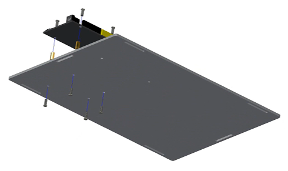
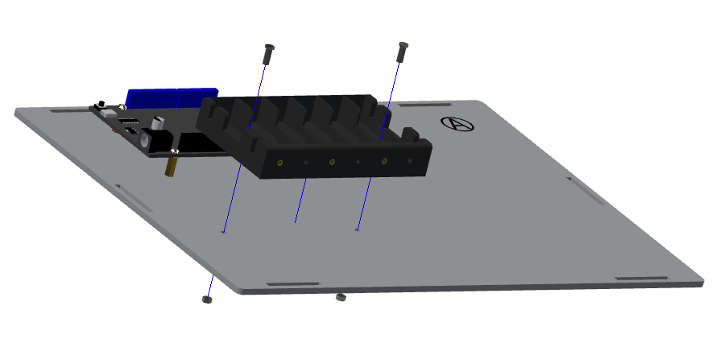

底座部分的安装
===========================

步骤 1：ESP32 开发板的安装
---------------------------

零件清单：
- “A” 板
- ESP32 开发板
- M3*8 螺丝（8 颗）
- M3*16 铜柱（4 颗）

注意事项：
1. 螺丝顺序：椴木板底面 → 铜柱 → ESP32 → 螺丝拧紧。
2. 带序号的一面建议朝内。

步骤 2：电池盒的安装
---------------------------

零件清单：
- 电池盒
- M3*10 平头螺丝（2 颗）
- M3 螺母（2 颗）

注意事项：
- 必须用平头螺丝，否则会顶住电池。

步骤 3：底座的安装
---------------------------

零件清单：
- “B, C, D, E, F” 板
- 蓝色栓扣（6 颗）

.. image:: _static/4.底座盖板-栓扣安装.png
   :alt: 底座安装
   :align: center
   :width: 400px

注意事项：
- “F” 板最后安装。
- 只需装底部 6 个栓扣。