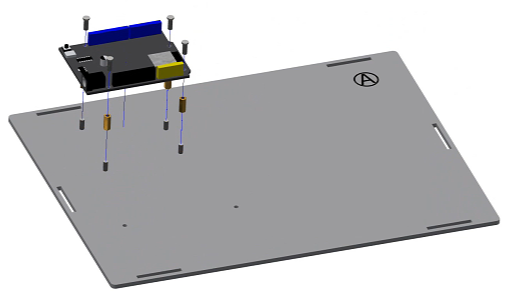

底座部分的安装
===========================

步骤 1：ESP32开发板的安装
---------------------------

零件清单：
- 序号为“A”的椴木板、ESP32开发板、M3*8螺丝（8颗）、M3*16铜柱（4颗）。

注意事项：
（1）先将螺丝从序号为“A”的椴木板底面穿过，再放置铜柱拧紧，随后放置ESP32开发板，再将螺丝拧紧。  

（2）带有序号的是为了方便识别不同的椴木板，教程展示安装时带序号的面会朝外安装，实际安装时可将带序号的一面朝内，后续的椴木板安装也应该如此。

步骤 2：电池盒的安装
---------------------------

零件清单：
- 电池盒
- M3*10 平头螺丝（2 颗）
- M3 螺母（2 颗）

.. image:: _static/2.电池盒安装2.png
   :alt: 电池盒安装
   :align: center
   :width: 400px

注意事项：
- 必须用平头螺丝，否则会顶住电池。

步骤 3：底座的安装
---------------------------

零件清单：
- “B, C, D, E, F” 板
- 蓝色栓扣（6 颗）

.. image:: _static/4.底座盖板-栓扣安装.png
   :alt: 底座安装
   :align: center
   :width: 400px

注意事项：
- “F” 板最后安装。
- 只需装底部 6 个栓扣。