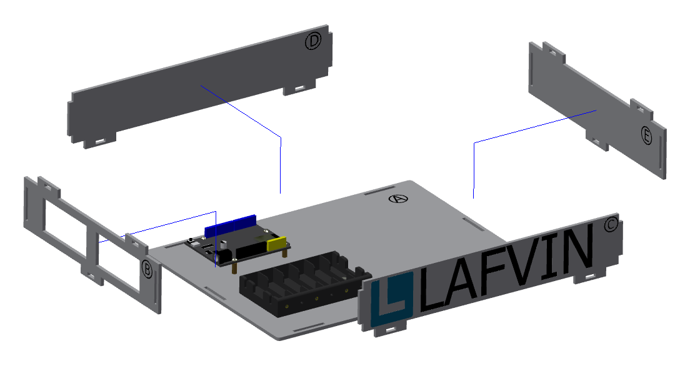

一、底座部分的安装
===========================

步骤 1：ESP32开发板的安装
---------------------------

零件清单：序号为“A”的椴木板、ESP32开发板、M3*8mm螺丝（8颗）、M3*16mm铜柱（4颗）。

安装如下图所示：

.. image:: _static/开发板安装带螺丝.png
   :alt: ESP32开发板安装
   :align: center

.. raw:: html

   

.. admonition:: 注意事项

 - 先将螺丝从序号为“A”的椴木板底面穿过，再放置铜柱拧紧，随后放置ESP32开发板，再将螺丝拧紧。  
 - 带有序号的是为了方便识别不同的椴木板，教程展示安装时带序号的面会朝外安装，实际安装时可将带序号的一面朝内，后续的椴木板安装也应该如此。

步骤 2：电池盒的安装
---------------------------

零件清单：电池盒、M3*10mm平头螺丝（2颗）、M3螺母（2颗）。

安装如下图所示：

.. image:: _static/电池盒带螺丝.png
   :alt: 电池盒安装
   :align: center
 

.. admonition:: 注意事项

 - 固定电池盒的螺丝选用平头螺丝，使用圆头螺丝会突出顶住电池，电池无法正常安装。

步骤 3：底座的安装
---------------------------

零件清单：序号为“B、C、D、E、F”的椴木板、蓝色栓扣（6颗）

安装如下图所示：

.. image:: _static/4.底座盖板-栓扣安装.png
   :alt: 底座安装
   :align: center
 

.. admonition:: 注意事项
 - 序号为“B、C、D、E、”的椴木板安装顺序没有强制要求，但是椴木板“F”,应在它们之后安装。
 - 这一步骤只需安装最底下6个栓扣，与椴木板“F”连接的栓扣暂时无需安装。

 底座部分安装完成效果如图所示：

 .. image:: _static/底座安装完成效果图.png
   :alt: 底座安装
   :align: center
