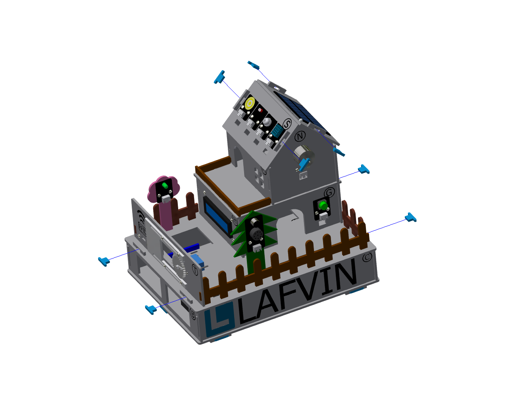
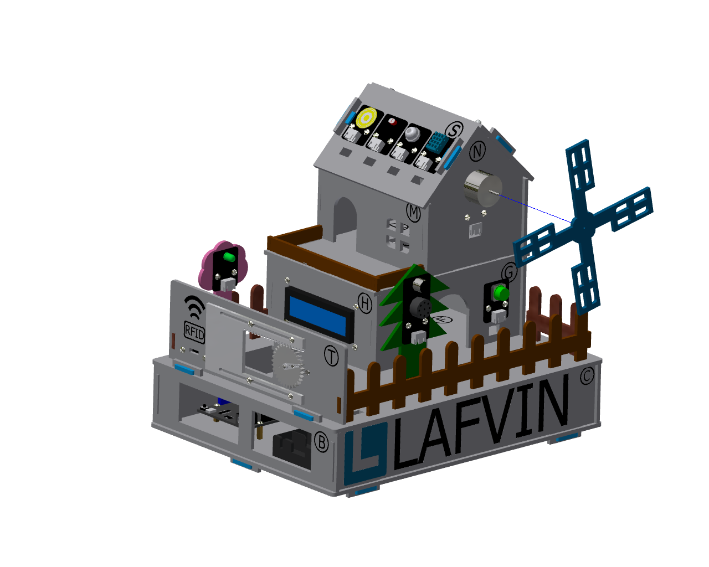
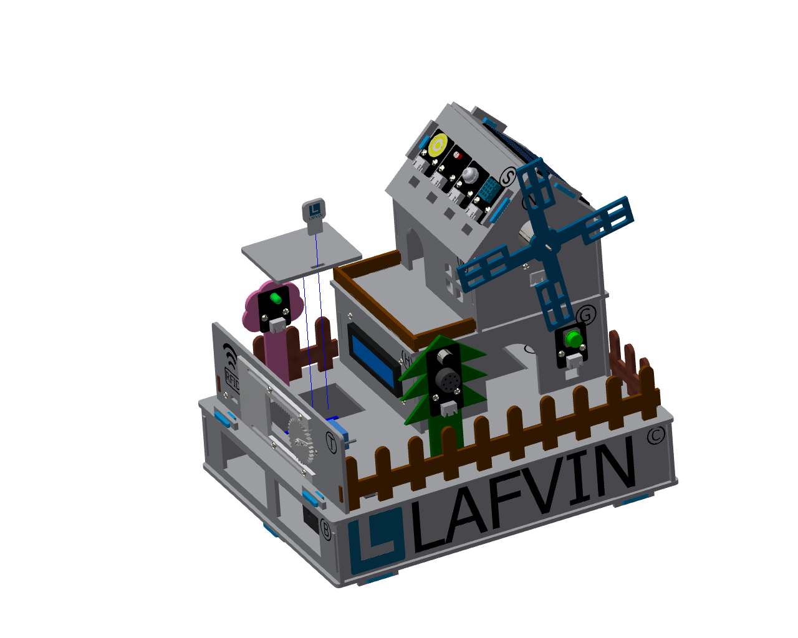

五、小屋固定部分的安装
===========================

步骤 1：底座固定
---------------------------
零件清单：蓝色的栓扣（8颗）

安装如下图所示：

注意事项：
 - 栓扣的安装需要将传感器元件接完线，调试运行正常后再安装锁紧。

步骤 2：风车扇叶
---------------------------
零件清单：蓝色风车扇叶

安装如下图所示：

步骤 3：调试窗口盖板
---------------------------
零件清单：调试窗口盖板、带logo的栓扣

安装如下图所示：

注意事项：
 - 此调试盖板方便用于日常的设备调试、检查接线和开发板状态时使用。
 
 小屋安装完成效果图
---------------------------
.. image:: _static\小屋安装完成效果图.png
   :alt: 调试窗口盖板
   :align: center
   :width: 400px
