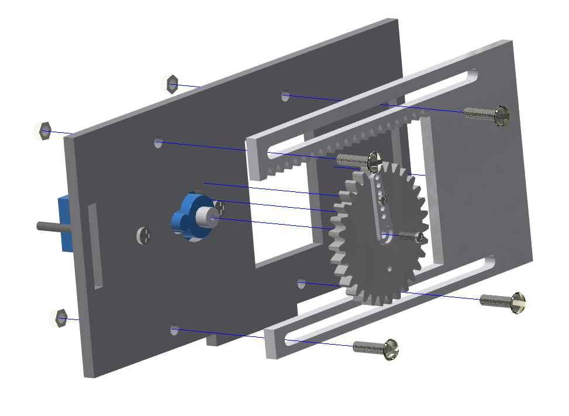
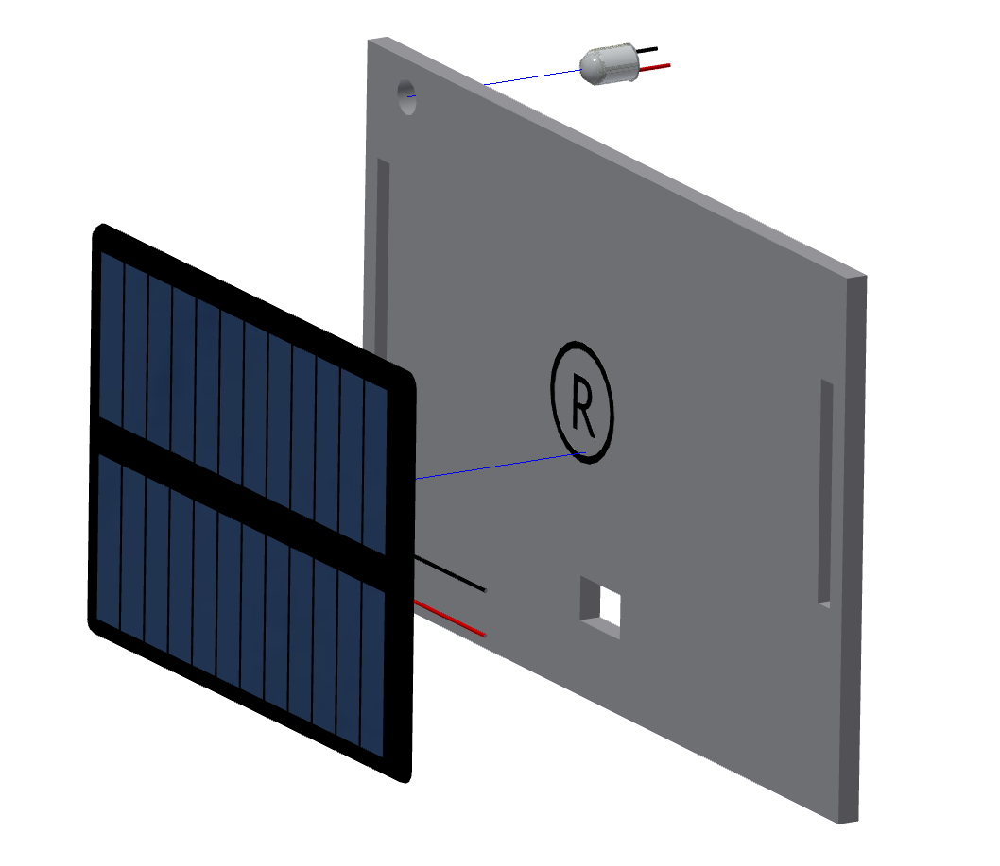
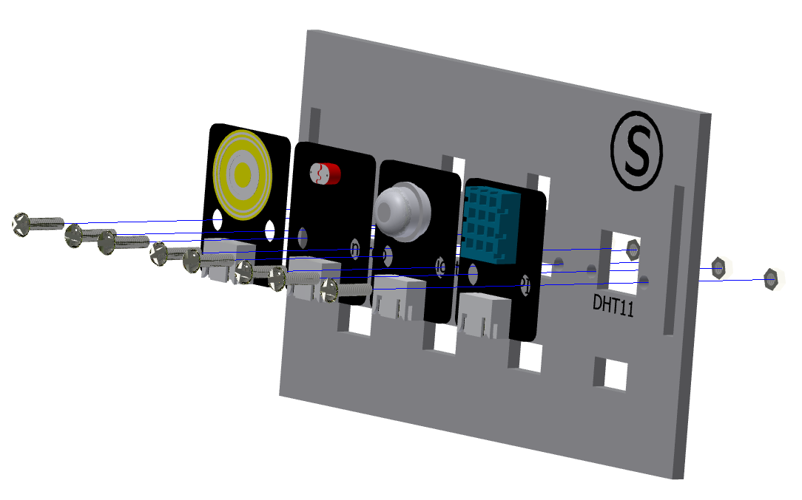
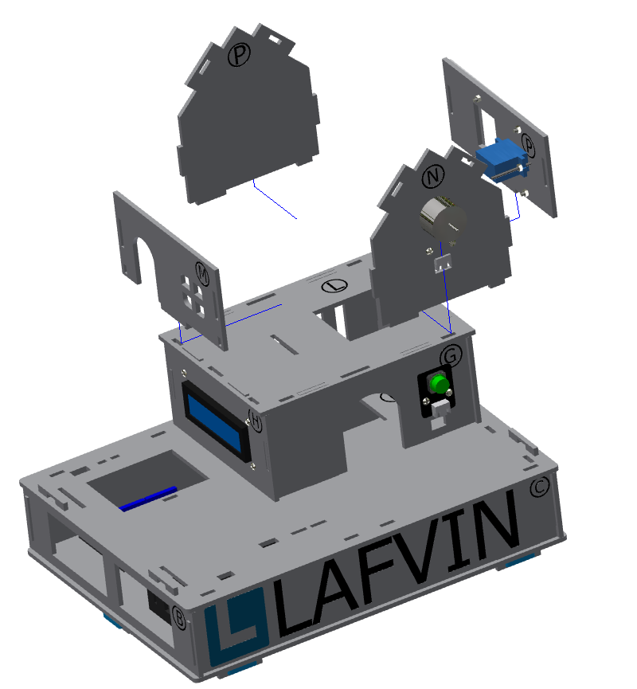
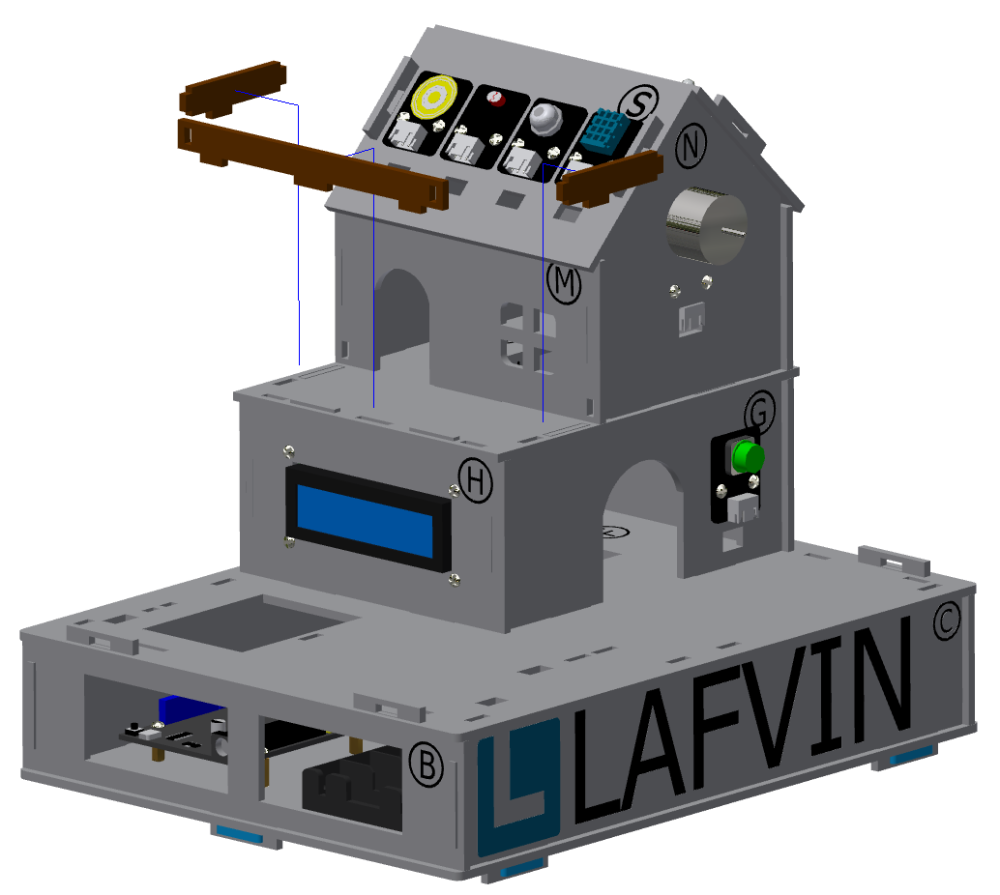

三、小屋二层的安装
===========================

步骤1：窗户部分的安装
---------------------------

步骤1-1：齿轮与摆臂的安装
^^^^^^^^^^^^^^^^^^^^^^^
零件清单：亚克力齿轮、舵机包（单向摆臂）、M1.5*5mm自攻螺丝（1颗）。

安装如下图所示：

.. image:: _static/齿轮摆臂安装图.png
   :alt: 窗户齿轮
   :align: center
   :width: 400px

注意事项：
 - 齿轮的小孔（左右两个均可）与摆臂第三个小孔对齐安装，再拧紧螺丝。
 - 此处安装与后续的大门控制齿轮安装步骤及零件一致，可在此步骤一并安装。

步骤1-2：窗户舵机安装至椴木板上
^^^^^^^^^^^^^^^^^^^^^^^^^^^^
零件清单：序号为“P”的椴木板、舵机包（舵机）、M2*30mm螺丝（2颗）、M2螺母（2颗）。

安装如下图所示：

步骤1-3：窗户的齿轮与亚克力板安装至椴木板上
^^^^^^^^^^^^^^^^^^^^^^^^^^^^
零件清单：序号为“P”的椴木板、窗户亚克力驱动板（较短的亚克力）、组装好的齿轮、舵机包（最短的一颗螺丝-M2*4mm）、M3*12mm螺丝（4颗）、M3螺母（4颗）

安装如下图所示：

注意事项：
 - 亚克力窗户驱动板安装到椴木板上时，固定的螺丝无需拧太紧，需要保留冗余，窗户在滑动的时候才能顺滑。
 - 窗户的亚克力驱动板的齿条应朝上安装。

窗户安装完成效果图：

.. image:: _static/窗户安装完成效果图.png
   :alt: 窗户安装完成效果图
   :align: center
   :width: 400px

步骤2：电机风扇的安装
---------------------------
零件清单：序号为“N”的椴木板、电机风扇模块、M3*12mm螺丝（2颗）、M3螺母（2颗）。

安装效果如下图所示：

.. image:: _static/电机安装图.png
   :alt: 风扇安装
   :align: center
   :width: 400px

步骤3：太阳能充电板的安装
---------------------------
零件清单：序号为“R的椴木板、太阳能充电板、太阳能充电指示灯、点胶。

安装如下图所示：

.. image:: _static/太阳能安装接线示意图.png
   :alt: 太阳能接线
   :align: center
   :width: 400px
   

注意事项：
 - 太阳能充电指示灯时，先将两端的接线拆开，连接太阳能板的线通过开孔穿过序号为“R”的椴木板，再与指示灯连接起来，可使用点胶固定

步骤4：传感器模块的安装
----------------------
零件清单：序号为“S”的椴木板、DHT11温湿度传感器、人体红外传感器、光敏亮度传感器、雨滴传感器、M3*12mm（8颗）、M3螺母（8颗）。

安装如下图所示：

注意事项：
 - 根据标注在椴木板的提示位置，安装对应的传感器。

步骤5：小屋二层的安装
--------------------

零件清单：序号为“M、Q”的椴木板、安装好元件的“N、P”椴木板。

安装如下图所示：

注意事项：
 - 序号为“N、Q”的椴木板下端的左右两个凸出长度不同，注意区分安装。
 
步骤6：屋顶的安装
----------------

零件清单：安装好元件的“S、R”椴木板。

安装如下图所示：

.. image:: _static/15.屋顶安装.png
   :alt: 屋顶安装
   :align: center
   :width: 400px

步骤7：二层围栏的安装
---------------------------

零件清单：棕色的围栏椴木板（短小的、三条）

安装如下图所示：

小屋二层安装完成效果图：

.. image:: _static/16.二层安装完成效果图.png
   :alt: 二层安装完成效果图
   :align: center
   :width: 400px