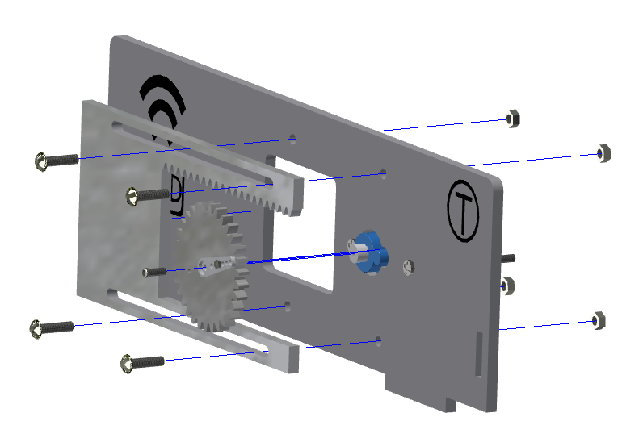
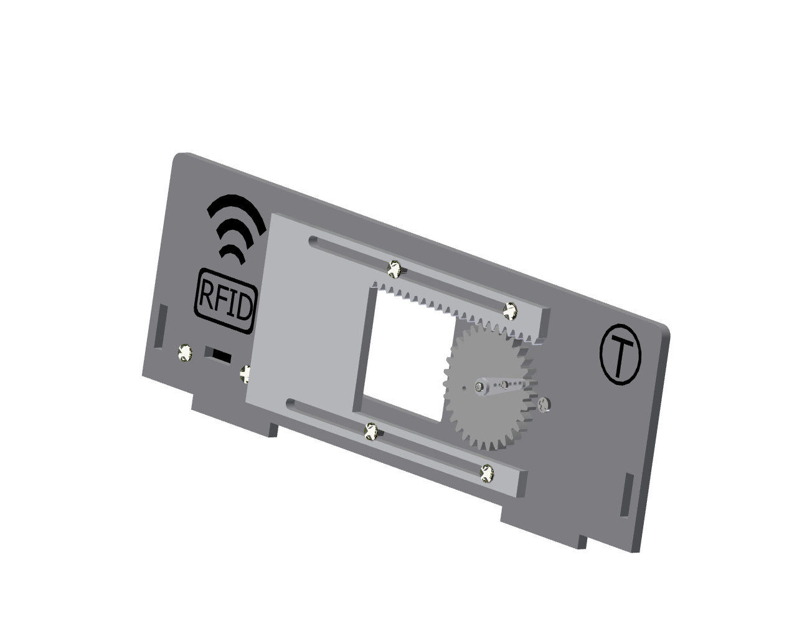
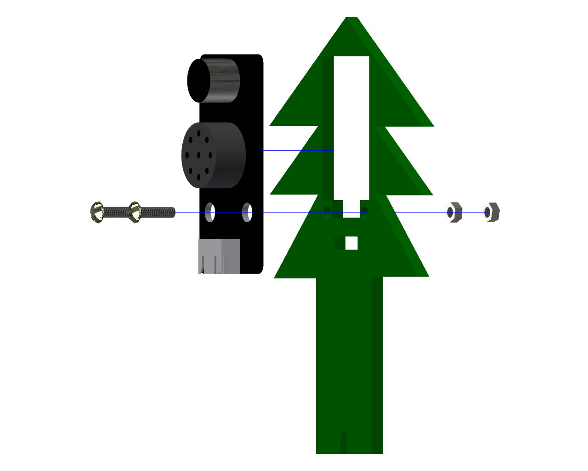
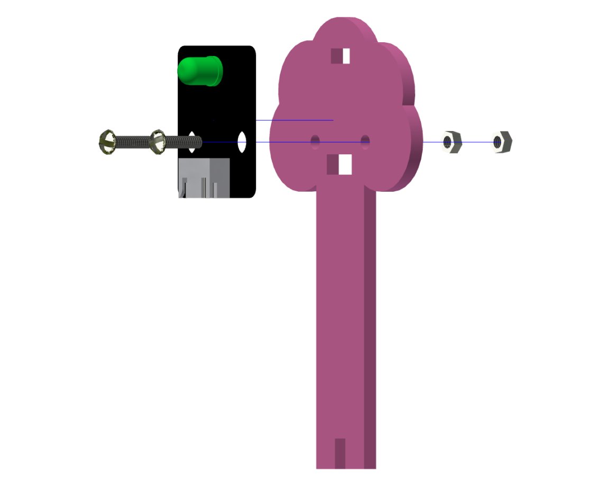
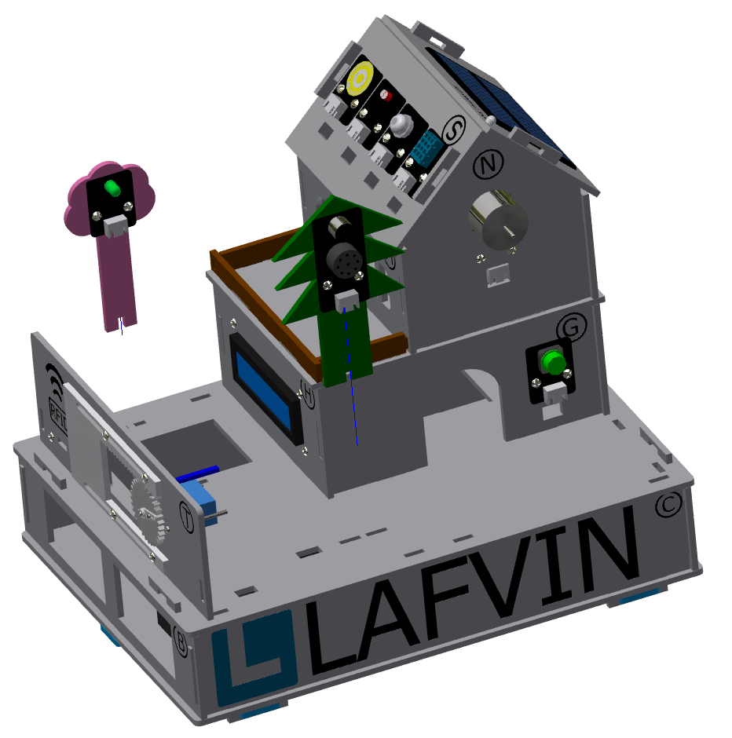
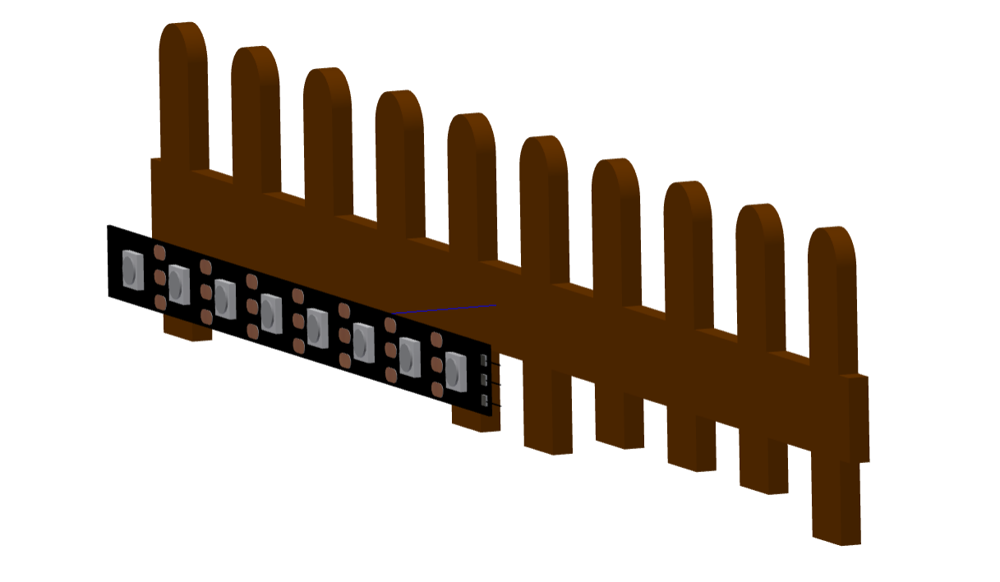
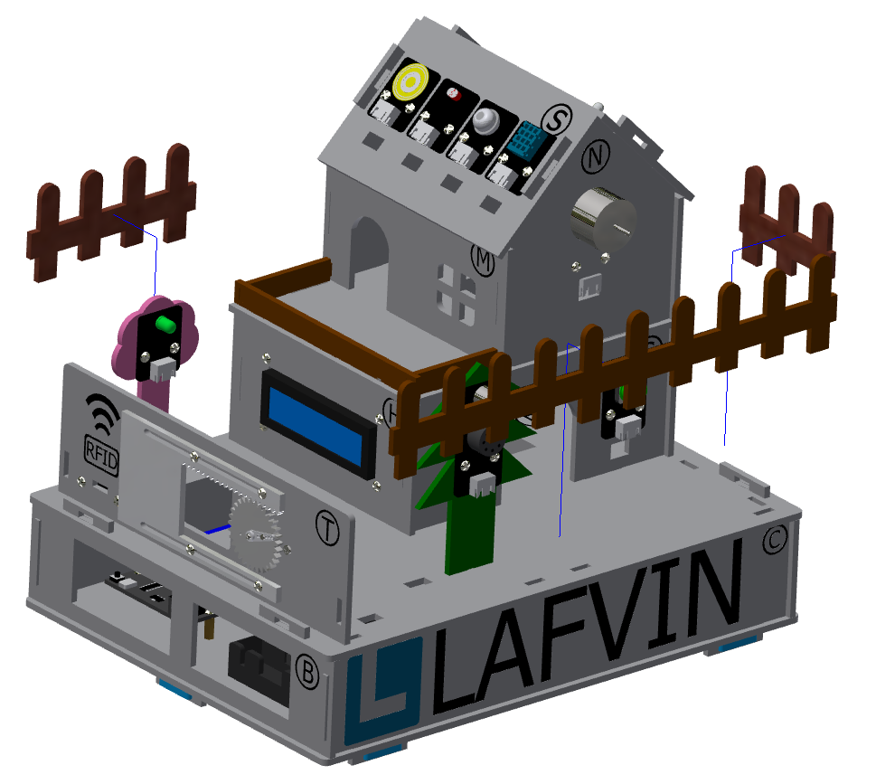

四、小屋花园的安装
===========================

步骤1：大门的安装
---------------------------

步骤1-1：齿轮与摆臂的安装
^^^^^^^^^^^^^^^^^^^^^^^
零件清单：亚克力齿轮、舵机包（单向摆臂）、M1.5*5mm自攻螺丝（1颗）。

安装如下图所示：

.. image:: _static/齿轮摆臂安装图.png
   :alt: 大门齿轮
   :align: center
   :width: 400px

注意事项：
 - 齿轮的小孔（左右两个均可）与摆臂第三个小孔对齐安装，再拧紧螺丝。
 - 此处安装与之前的窗户控制齿轮安装步骤及零件一致，如之前已安装好，此步骤可忽略。

步骤1-2：窗户舵机安装至椴木板上
^^^^^^^^^^^^^^^^^^^^^^^^^^^^
零件清单：序号为“T”的椴木板、舵机包（舵机）、M2*30mm螺丝（两颗）、M2螺母（2颗）。

安装如下图所示：

.. image:: _static/18.大门舵机安装.png
   :alt: 舵机安装至椴木板
   :align: center
   :width: 400px

步骤1-3：大门的齿轮与亚克力板安装至椴木板上
^^^^^^^^^^^^^^^^^^^^^^^^^^^^
零件清单：序号为“P”的椴木板、亚克力驱动板（较长的亚克力）、组装好的齿轮、舵机包（最短的螺丝-M2*4mm）、M3*12mm螺丝（4颗）、M3螺母（4颗）

安装如下图所示：

注意事项：
 - 大门的亚克力驱动板安装到椴木板正面时，固定的螺丝无需拧太紧，需要保留冗余，大门在滑动的时候才能平滑。
 - 大门的亚克力驱动板的齿条应朝上安装。

大门安装完成效果图：

步骤1-5：大门安装到花园
---------------------------
零件清单：安装好舵机、RFID感应模块以及亚克力的椴木板“T”。

安装如下图所示：

.. image:: _static/20.大门安装.png
   :alt: 大门安装
   :align: center
   :width: 400px

步骤2：语音识别模块的安装
---------------------------
零件清单：语音识别模块、绿色的树椴木板、M3*12mm螺丝（2颗）、M3螺母（2颗）。

安装如下图所示：

步骤3：LED灯模块的安装
---------------------------
零件清单：LED灯模块、粉色的花椴木板、M3*12mm螺丝（2颗）、M3螺母（2颗）。

安装如下图所示：

步骤4：花和树安装到花园上
---------------------------
零件清单：安装好语音识别模块的绿色的树椴木板、安装好LED灯模块的粉色的花椴木板。

安装如下图所示：

步骤5：RGB灯带的安装
---------------------------
零件清单：RGB灯带、棕色的围栏椴木板（最长的一条围栏）

安装如下图所示：

注意事项：
 - 先将RGB灯带背面的胶带撕下，再粘贴于围栏背面。
 - 为了RGB灯带发光时效果更佳，RGB灯带尽量居中粘贴于围栏背面。

步骤6：花园围栏的安装
---------------------------
零件清单：棕色的花园围栏椴木板（短的2条）、安装好RGB灯带的围栏。

安装如下图所示：

注意事项：
 - 短的两条围栏安装位置需辨认清楚，较长的一条安装到大门旁，较短的一条安装到按键模块旁。